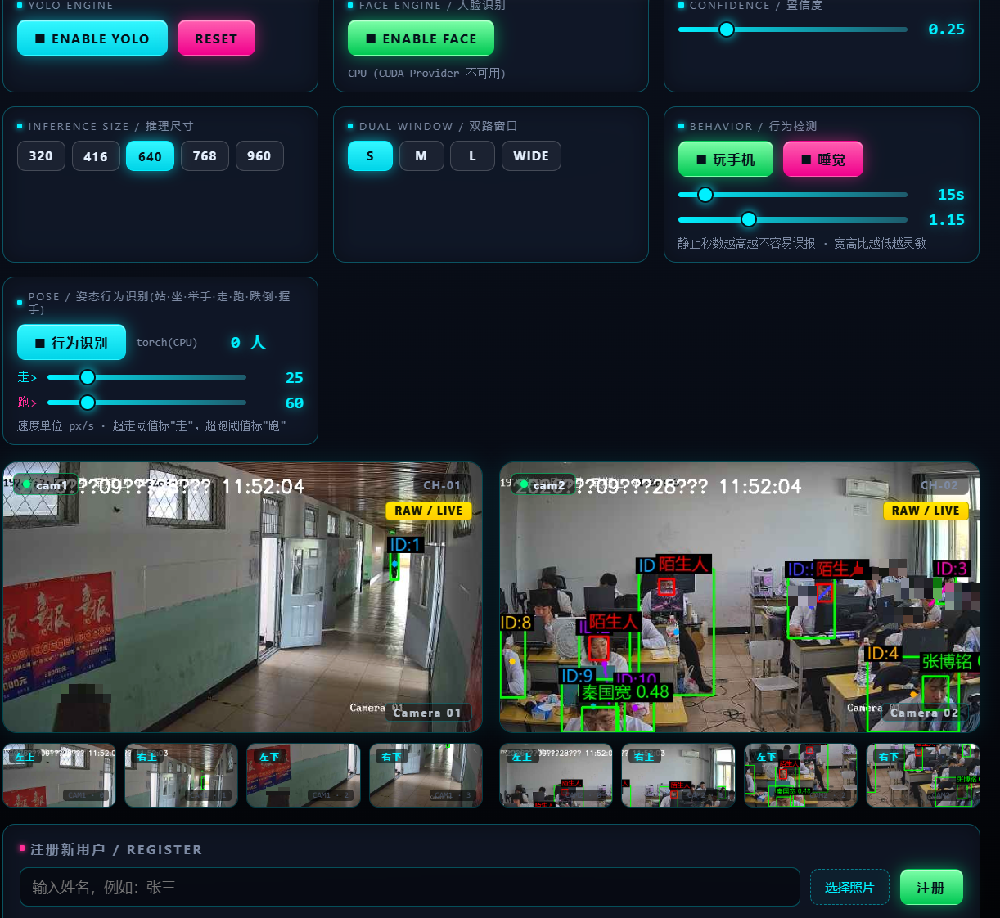

# Vision-Fusion Human Monitor


基于 **YOLOv8 + OpenVINO + InsightFace + 大模型** 的本地实时人体监控系统，支持行人检测、姿态估计、行为识别（跌倒 / 睡觉 / 玩手机）、人脸识别，并内置一个通过大模型驱动的「数字狗」智能问答助手。

> 纯本地 CPU 推理为主，无需 GPU 即可运行，适合在普通电脑 / 边缘设备上部署。

## 界面预览



*双路实时监控：绿色框为人体检测，红色框为人脸识别（图中人脸已做马赛克脱敏处理）。*

---

## 功能特性

- **目标检测**：YOLOv8 对双路视频快照切片检测 `person`，实时绘制人体框
- **姿态估计**：YOLOv8-pose 输出 17 个人体关键点，判断 **跌倒 / 行走 / 静止**
- **行为识别**：结合轨迹跟踪（卡尔曼滤波）判断 **睡觉 / 玩手机 / 跌倒** 等异常行为
- **人脸识别**：InsightFace 提取人脸特征 + FAISS 向量检索，区分「库内熟人 / 陌生访客」
- **多目标追踪**：卡尔曼滤波恒定速度模型跨帧跟踪，给每个人稳定 ID 并绘制移动轨迹
- **智能问答**：「数字狗」监控助手，自动总结现场并回答你的提问；检测到异常自动告警
- **Web 管理页**：Flask 提供实时监控画面 + 四象限预览 + 人脸库注册 / 管理
- **算力友好**：切片检测、人脸节流、CPU 保护等机制，普通 CPU 也能多路流畅跑

## 技术栈

| 模块 | 技术 |
| --- | --- |
| 检测 / 姿态 | Ultralytics YOLOv8 / YOLOv8-pose |
| 推理加速 | Intel OpenVINO（CPU），onnxruntime-gpu 兜底 |
| 人脸识别 | InsightFace (FaceAnalysis) |
| 向量检索 | FAISS（自建人脸库 +15 万级检索） |
| 目标追踪 | 卡尔曼滤波 + 最近邻关联 |
| Web 服务 | Flask + HTML 模板 |
| 大模型问答 | 硅基流动 Qwen2.5-7B-Instruct（云端），本地 Ollama qwen2.5:3b 兜底 |

## 目录结构

```
vision-fusion-openvino_test/
├── app.py             # Flask 主程序：拉流、检测、人脸识别、Web 页面
├── ov_yolo.py         # OpenVINO YOLOv8 / YOLOv8-pose 推理封装（兼容 ultralytics 接口）
├── monitor_agent.py   # 「数字狗」AI 监控 Agent：轮询告警 + 随时问答
├── llm_helper.py      # 大模型调用：网络自动探测（直连/代理/IP 兜底）
├── run_all.py         # 一键启动：监控服务 + AI Agent
├── templates/         # Web 前端页面
└── 数据库/            # 人脸库特征向量（faiss_vecs.npy / names.json，隐私，不入库）
```

## 快速开始

依赖环境建议使用 conda，并已安装 ultralytics / openvino / insightface / faiss 等。

```bash
# 1. 安装依赖
pip install -r requirements.txt

# 2. 准备模型文件（.pt / .onnx 不收进仓库，请按尺寸 640 放到项目根目录）
#    - yolov8n.onnx / yolov8m.pt   目标检测
#    - yolov8n-pose.pt / onnx      姿态估计
#    - insightface 所需 onnx 模型 人脸识别

# 3. 配置大模型密钥（可选，否则数字狗只用本地 Ollama）
#    方式 A：设置环境变量
set SILICONFLOW_API_KEY=sk-xxx
#    方式 B：在项目根目录创建 siliconflow.key 文件并写入密钥

# 4. 一键启动（会自动打开浏览器 http://localhost:5000）
python run_all.py
```

单独启动：

```bash
python app.py            # 只启动监控服务
python monitor_agent.py  # 只启动 AI 监控 Agent
```

## 使用说明

1. **监控画面**：启动后浏览器访问 `http://localhost:5000`，可看到双路视频的实时检测标注
2. **人脸库管理**：在 Web 页面注册 / 删除人脸，`陌生人` 会红框提示并计入异常
3. **数字狗问答**：启动 Agent 后，在命令行输入问题即可交互，实时结合当前现场回答
4. **异常告警**：检测到 `跌倒 / 睡觉 / 玩手机 / 陌生人` 时，Agent 自动调用大模型生成告警文案

## 隐私与安全

- 人脸特征库（`数据库/`、`face_db.npz`）、大模型密钥（`siliconflow.key`）均已通过 `.gitignore` 排除，**不会进入仓库**，请放心公开代码。
- 运行所需模型权重（`.pt` / `.onnx`）同样不在仓库内，需自行按尺寸准备。

## 说明

本项目为作者个人 CV / AI 工程实践作品，用于学习与作品集展示。摄像头取流地址请在 `app.py` 中按实际配置修改。